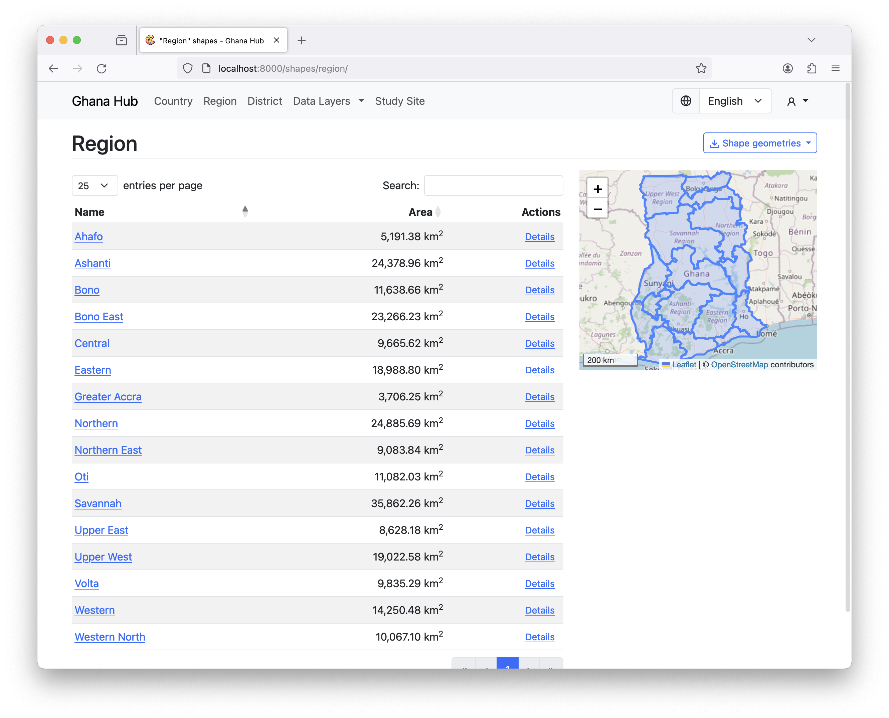
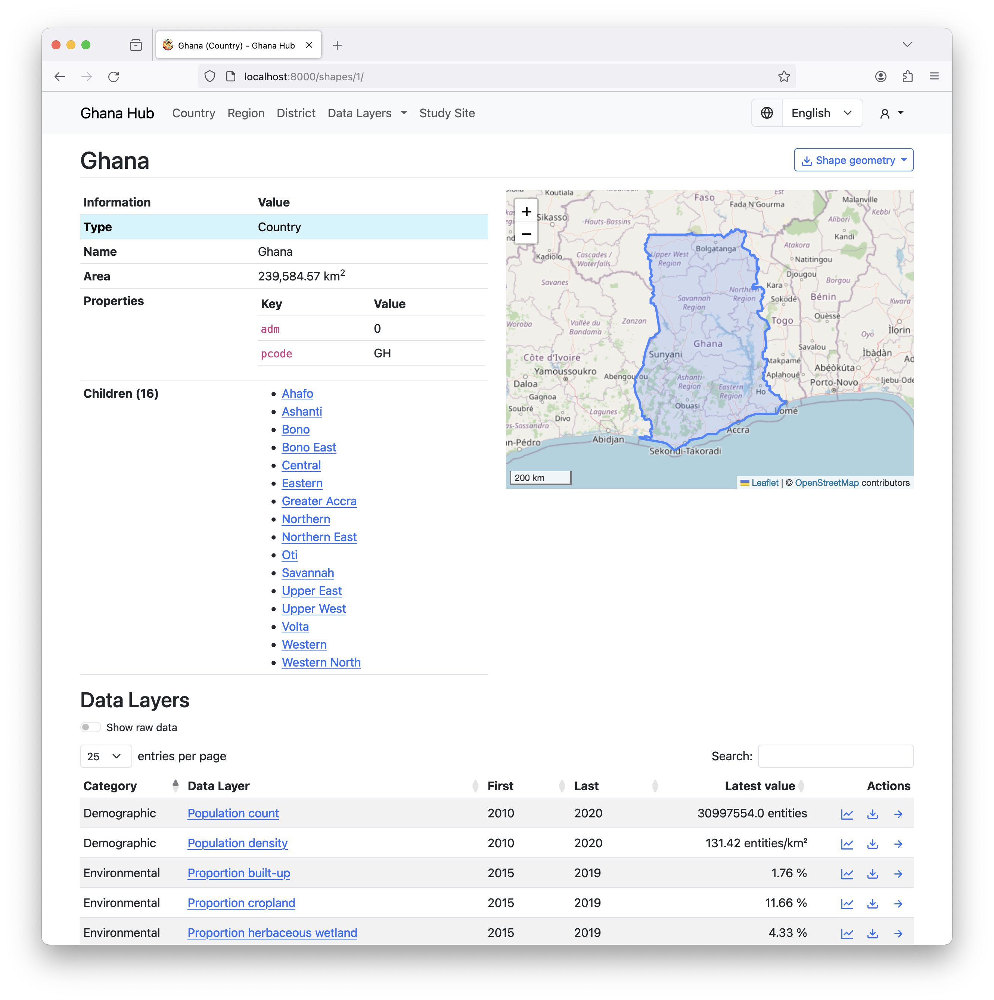
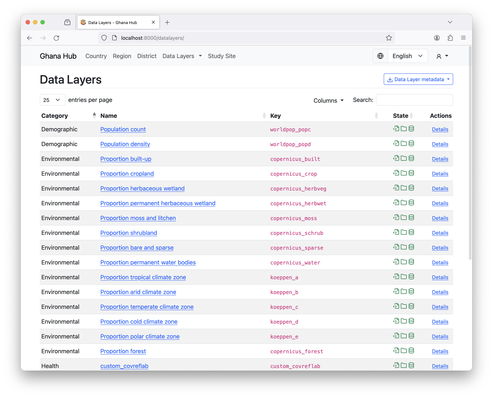
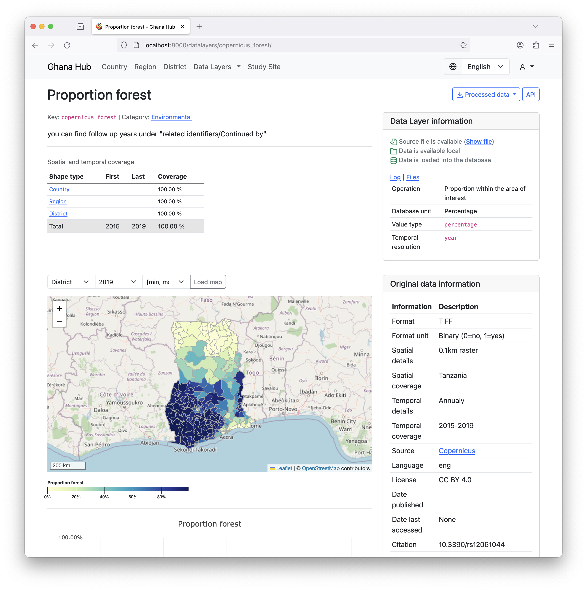

# Interface

This shows the most relevant features and concepts of the interface of the Data Hub. 

## Shape list

- Interactive table of loaded shape files that can be searched
- Interactive map to search for a shape geographical

## Shape detail

- Information for specific shape (connected parent/child shapes)
- Preview of actual geometry
- The Latest value of each loaded Data Layer specific to this shape

## Data Layer list

- Interactive table of available Data Layers that can be searched
- Table shows state of each Data Layer (integrated/processed)

## Data Layer detail

- Description of the data layer, provides metadata and summary
- Statistics about the processed data
- Interactive visualizations for geographical and temporal dimensions

